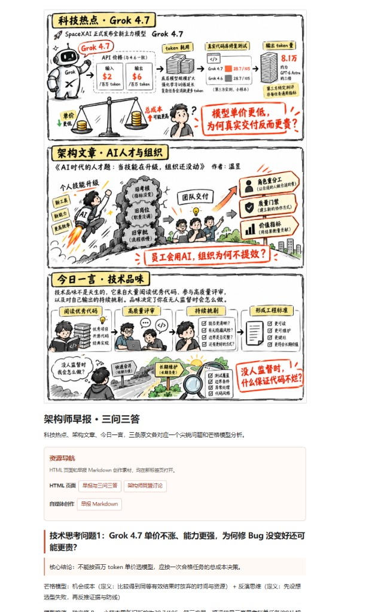
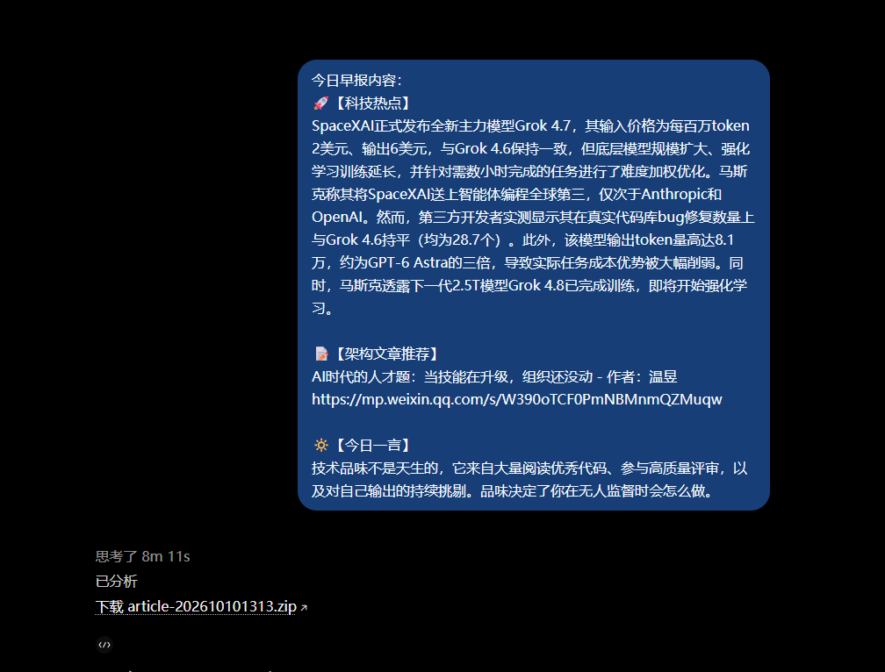

# zaobao Skill v6.1｜架构师早报三问与同盟讨论

面向 **GPT / ChatGPT 自定义 Skill（及兼容 Agent Skills 的工具）**：输入三栏早报原文，闭环产出芒格三问三答、同盟讨论帖、微信友好 HTML、Image 2.5 手绘白板图，并打包为**唯一**发布物 `article-YYYYMMDDHHMM.zip`。

技能入口：[`SKILL.md`](./SKILL.md)（`name: zaobao`，`version: 6.1.0`）

---

## 它做什么

| 输入（三栏，缺一不可） | 输出（默认只交付这一份 ZIP） |
|---|---|
| 【科技热点】 | `index.html` 早报原文 + 三问芒格回答 |
| 【架构文章推荐】 | `talk.htm` 同盟 3 道讨论（引导语 → 配图 → 主持人答案） |
| 【今日一言】 | `md/zaobao.md`、`md/talk.md`、`md/talk-prompts.txt` |
| | `img/` 两张白板原画 + 六张主题截图 + ImageGen 溯源 JSON |
| | `index.json`（wxp-writer 元数据，`checkStatus=unaudited`） |

每栏各抽 **一个** 尖锐架构问题，不得挪用其他日期话题；保留早报逐字原文与真实 URL。

---

## 安装

整目录拷贝到所用工具的 skills 目录即可：

```bash
# GPT / ChatGPT 自定义 Skill（按平台实际上传或目录约定）
# 本仓库路径：
gpt/skill/zaobao/

# 兼容 Agent Skills 的常见落点示例
cp -r gpt/skill/zaobao ~/.codex/skills/zaobao
cp -r gpt/skill/zaobao ~/.claude/skills/zaobao
cp -r gpt/skill/zaobao .cursor/skills/zaobao
```

依赖（本地打包 / 单测）：Python 3.10+、`Pillow`；浏览器冒烟另需 Playwright（见 `scripts/browser_smoke.py`）。

---

## 成品示例（2026-10-10）

一期真实交付：输入三栏早报（Grok 4.7 / 温昱人才题 / 技术品味），最终回复只给一个 `article-202610101313.zip`。

解压后 `index.html` 预览（手绘白板 + 三问三答 + 资源导航）：



对话交付截图（唯一 ZIP 链接）：



| 样例 | 说明 |
|---|---|
| [`examples/preview-202610101313.png`](./examples/preview-202610101313.png) | 发布包 `index.html` 预览截图 |
| [`examples/delivery-202610101313.png`](./examples/delivery-202610101313.png) | 对话交付截图（唯一 ZIP 链接） |
| [`examples/article-202610101313.zip`](./examples/article-202610101313.zip) | 完整发布包（可解压对照 HTML / md / img） |
| [`examples/demo-2026-10-08.json`](./examples/demo-2026-10-08.json) | 本地 `build.py` 回归输入（另一期） |

---

## 使用方式（自然语言）

在已安装该 Skill 的对话里，直接贴三栏原文，例如：

> 用 zaobao 跑今天这期早报：  
> 【科技热点】……（含链接）  
> 【架构文章推荐】……（含链接）  
> 【今日一言】……

Agent 应按 `SKILL.md` 自动完成：检索核验 → 三问三答 → 同盟话术 → Image 2.5 出图（风格锚点见 `assets/`）→ `build.py` 打包 → D1–D12 闸门 → **最终回复只给一个** `article-YYYYMMDDHHMM.zip` 下载链接。

时间戳按**打包完成时刻**、用户时区生成（默认 `Asia/Shanghai`），不是早报日期。

除非你**明确**要求 Skill 安装包、测试报告或其他单文件，否则不要追问「给我产物」——默认合同就是那一个 ZIP。

---

## 本地脚本打包（有已核验的 ImageGen 原画时）

```bash
cd gpt/skill/zaobao

python scripts/build.py \
  --input examples/demo-2026-10-08.json \
  --brief-image /path/to/verified_imagegen_brief.png \
  --talk-image /path/to/verified_imagegen_talk.png \
  --gen-brief <真实 ImageGen ID> \
  --gen-talk <真实 ImageGen ID> \
  --out ./zaobao-build \
  --timezone Asia/Shanghai
```

单测与冒烟：

```bash
ZAOBAO_TEST_BRIEF_IMAGE=/path/to/verified_imagegen_brief.png \
ZAOBAO_TEST_TALK_IMAGE=/path/to/verified_imagegen_talk.png \
python -m unittest discover -s tests -v

python scripts/browser_smoke.py --root ./zaobao-build --reports ./zaobao-reports
```

`--gen-brief` / `--gen-talk` 必须是真实生成回执 ID，不可伪造。无合格 ImageGen 原画时**禁止**用程序重绘架构图凑数。

---

## 发布 ZIP 结构（验收对照）

```text
article-YYYYMMDDHHMM.zip
├── index.html
├── talk.htm
├── index.json
├── md/
│   ├── zaobao.md
│   ├── talk.md
│   └── talk-prompts.txt
├── img/
│   ├── original-brief-imagegen.png
│   ├── original-talk-imagegen.png
│   ├── 01-brief-whiteboard.png
│   ├── 02-talk-whiteboard.png
│   ├── brief-topic-{1,2,3}.png
│   └── talk-topic-{1,2,3}.png
└── imagegen-provenance.json
```

硬约束摘要：

1. ZIP **不得**含 `skill/`、开发测试日志等目录。
2. `index.html` 资源导航仅三个入口：`index.html`、`talk.htm`、`md/zaobao.md`；所有 `<a>` 须 `target="_blank" rel="noopener noreferrer"`。
3. 白板风格以 `assets/style-reference-brief.png` / `style-reference-talk.png` 为准；图中禁止「便于截图」等制作用途文案。
4. 默认 `checkStatus=unaudited`，不得宣称已在微信后台发布。
5. 交付前按 [`references/D1-D12.md`](./references/D1-D12.md) 做末端闸门；HIT 先修再交。

---

## 目录说明

| 路径 | 用途 |
|---|---|
| `SKILL.md` | Agent 执行规范（输入输出、HTML/图片/测试合同） |
| `scripts/build.py` | 确定性打包与时间戳命名 |
| `scripts/browser_smoke.py` | HTML 冒烟 |
| `tests/` | 结构与回归单测 |
| `examples/demo-2026-10-08.json` | 本地打包回归输入 |
| `examples/preview-202610101313.png` | 发布包首页预览截图 |
| `examples/delivery-202610101313.png` | 真实交付截图（单 ZIP） |
| `examples/article-202610101313.zip` | 真实交付发布包样例 |
| `assets/` | 用户确认的白板风格参考图 |
| `references/` | D1–D12、wxp-json、release notes、研究备注 |

更细规则（芒格答案格式、同盟话术模板、ImageGen 溯源等）一律以 `SKILL.md` 为准。

---

## 版本

- **v6.1.0**：单一时间戳产物 `article-YYYYMMDDHHMM.zip`；首页导航强制含 `md/zaobao.md`；全部链接新页签；图片强制回归（原画哈希 + 像素裁切）。

变更说明见 [`references/release-notes-v6.1.md`](./references/release-notes-v6.1.md)。
